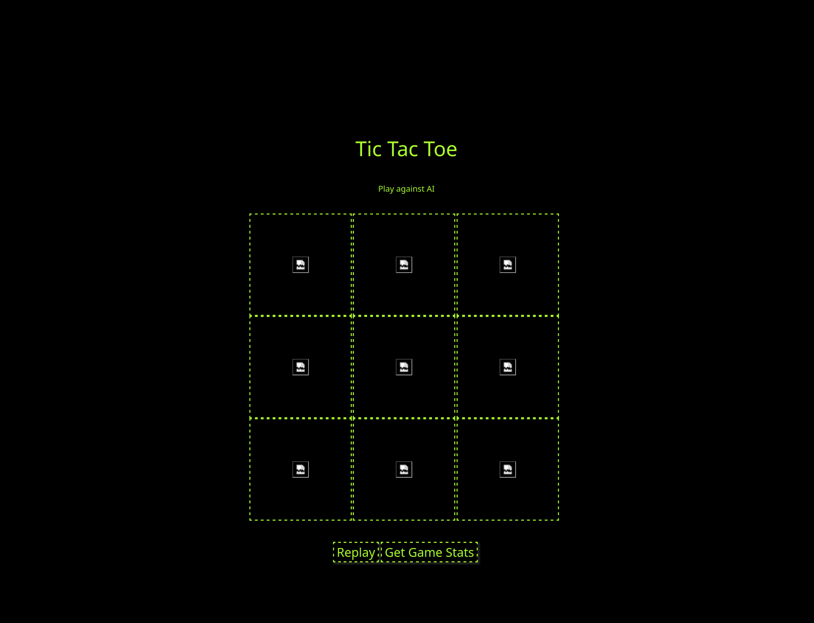
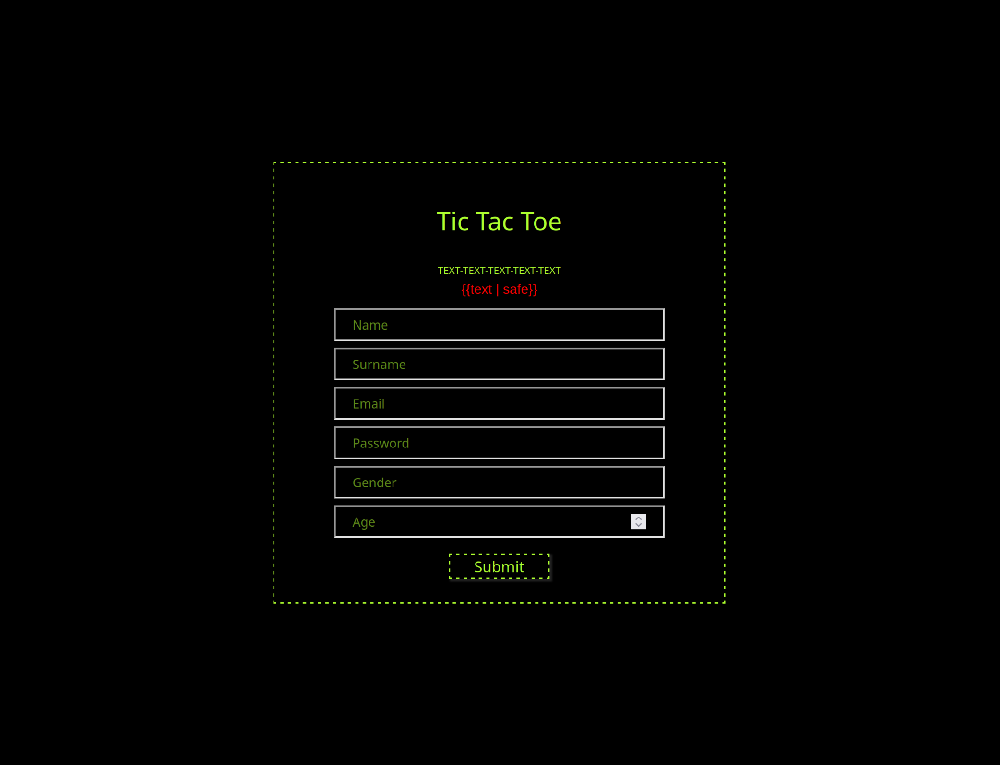
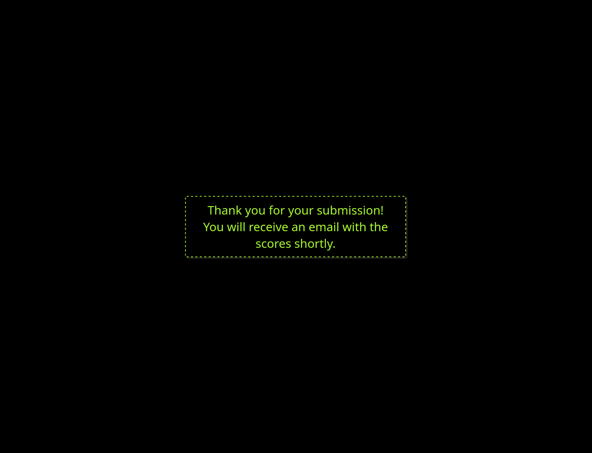

# 3t-tictactoe

Is web application to play TicTacToe online against a reinforcement learning algorithm.
This is the continuation of a project started during high school. See original project.

**Note**: The original project is not fully functional.

## Table of Contents
- [Project Overview](#projectoverview)
- [Goals](#goals)
- [Setup](#setup)
- [License](#license)
- [Design of Original Project](#design-of-original-project)

## Progress: 
## Project Overview

The aim of the project is to create a web application to play TicTacToe against a pre-trained reinforcement learning algorithm. Users will be able to take part in a competition. The progress of the game and personal information are stored in a database. In the current configuration the result of each games will sent to the user by email.

## Goals
- Create a functional version and depoly it online
- Connect backend (algorithm and database) and frontend (website)
- Improve the algorithm: 
    - The current algorithm isn't accurate and sufficient yet
- Improve the structre and code
    - Use a more object oriented style for more modularity 
    - Refactor: improve code usability and readability
- Testing: 
    - Create unit tests
    - Add Exception and handle errors
- Design:
    - Make design more responsive
    - Works in Desktop and Mobile view

## Setup
For an overview for required packages see [requirements](requirements.md)

## License 
*TO BE UPDATED*

## Design of Original Project
**Game**

**Credentials**

**Submission**

**Note**: The 
